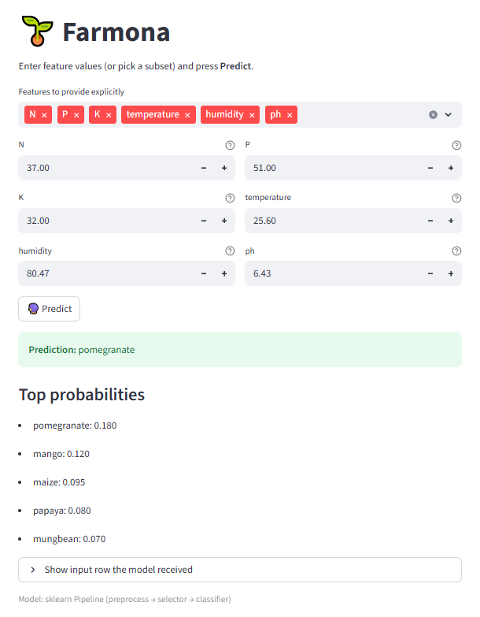

# 🌱 Farmona — Smart Crop Prediction & Agronomic Analysis

**Farmona** is an end-to-end machine learning project designed to predict crop types and provide agronomic insights.  
It combines **data analysis**, **feature engineering**, and **model optimization** in a Jupyter notebook with an interactive **Streamlit web application** for real-time predictions.

**🔗 Live App:** https://farmona.streamlit.app/

---

(https://farmona.streamlit.app/) 
*Example view of the Farmona Streamlit web application.*

## 🚀 Features

### 📊 Exploratory Data Analysis (EDA)
- Missing value detection and duplicate removal
- Outlier detection using IQR
- Feature distributions (histograms, boxplots)
- Correlation heatmaps and scatter matrices

### 🧪 Feature Engineering
- **THI** — Temperature–Humidity Index  
- **NBR** — Nutrient Balance Ratio  
- **WAI** — Water Availability Index  
- **PP** — Photosynthesis Potential  
- **SFI** — Soil Fertility Index  

### 🤖 Model Training & Selection
- Multiple algorithms tested:
  - Logistic Regression
  - Random Forest
  - XGBoost
  - Support Vector Classifier (SVC)
  - K-Nearest Neighbors (KNN)
- Feature selection methods:
  - SelectKBest (Mutual Information & ANOVA)
  - SelectFromModel (Random Forest)
  - PCA dimensionality reduction
- Hyperparameter tuning with **GridSearchCV**
- Performance metrics: accuracy, weighted F1-score, confusion matrix

### 📈 Model Evaluation
- Classification reports
- Confusion matrix visualization
- Learning curves
- Permutation feature importance ranking

### 💻 Interactive Web App
- Built with **Streamlit**
- User-friendly interface to:
  - Select which features to provide
  - Auto-fill missing features with dataset defaults
  - Predict crop type and show top probability breakdown
- Instant feedback with detailed probability distribution

---

## 🛠 Tech Stack

| Category           | Libraries / Tools                                    |
|--------------------|------------------------------------------------------|
| **Core Language**  | Python 3.x                                            |
| **Data Handling**  | pandas, numpy                                         |
| **Visualization**  | matplotlib, pandas.plotting                           |
| **Machine Learning** | scikit-learn, XGBoost                               |
| **Web App**        | Streamlit                                             |
| **Utilities**      | joblib, threadpoolctl, IPython                        |

---

## 📂 Repository Structure
📂 farmona/
├── 📓 notebook/  
│   └── crop_analysis.ipynb  # Full EDA, feature engineering, and model training  
├── 📂 webapp_artifacts/     # Saved model, label encoder, and schema for app  
├── streamlit_app.py         # Streamlit web app for predictions  
├── dataset.csv           # Dataset (if distributable)  
├── requirements.txt         # Dependencies for notebook + app  
└── README.md                # Project documentation  

---

## ⚡ Getting Started

### 1️⃣ Clone the repository
```bash
git clone https://github.com/yourusername/farmona.git
cd farmona
```

### 2️⃣ Create a virtual environment (Windows example)
```bash
python -m venv venv
venv\Scripts\activate
```

### 3️⃣ Install dependencies
```bash
pip install -r requirements.txt
```

### 4️⃣ Run the Jupyter notebook (optional)
```bash
jupyter notebook notebook/crop_analysis.ipynb
```

### 5️⃣ Launch the Streamlit web app
```bash
streamlit run streamlit_app.py
```


🙌 Acknowledgements

- Scikit-learn & XGBoost for robust machine learning tools

- Streamlit for the interactive UI framework

- Open-source datasets for agronomic research
